# ✈️ Airline Reservation System

## 📌 Descripción
Este proyecto es un **sistema de reservas de aerolíneas** basado en microservicios desarrollado con **FastAPI** y **PostgreSQL**. 

### 📍 Funcionalidades principales
- 📖 **Gestión de reservas** (Crear, Consultar, Listar, Cancelar)
- 🔎 **Búsqueda de vuelos**
- 👤 **Gestión de usuarios**
- 🔐 **Autenticación con JWT**
- 📜 **Documentación automática con Swagger**
- 🧪 **Pruebas automatizadas con `pytest`**

## 🏗️ Arquitectura del Proyecto
Este sistema está dividido en **tres microservicios**:

1️⃣ **`buscar_vuelos`** → Servicio para buscar vuelos disponibles (Puerto `8086`).  
2️⃣ **`reservar_vuelos`** → Servicio para gestionar reservas de vuelos (Puerto `8087`).  
3️⃣ **`gestion_usuarios`** → Servicio para administrar usuarios.(Puerto `8085`). 

Cada microservicio tiene su propia API y base de datos independiente para mayor escalabilidad y modularidad.

---

## 📥 **Clonar el repositorio**

Para obtener una copia local del proyecto, ejecuta el siguiente comando:

```bash
git clone https://github.com/Andy2691/airline-reservation-system.git
cd airline-reservation-system
```
---
## 📂 **Estructura del Proyecto**
```bash
📦 airline-reservation-system
 ┣ 📂 buscar.vuelos
 ┃ ┃ 📂 .vscode
 ┃ ┃ 📂 alembic
 ┃ ┣ 📂 app
 ┃ ┃ ┣ 📂 database
 ┃ ┃ ┣ 📂 migrations  # 📌 Contiene las migraciones de la base de datos
 ┃ ┃ ┣ 📂 models
 ┃ ┃ ┣ 📂 routes
 ┃ ┃ ┣ 📂 schemas
 ┃ ┣ 📜 config.py
 ┃ ┣ 📜 main.py
 ┣ ┣ ⚙️ alembic.ini
 ┣ ┣ 📜 requirements
 ┣ ┣ 📜 .gitignore
 ┣ ┣ 📜 README.md

 ┣ 📂 reservas.vuelos
 ┃ ┃ 📂 .vscode
 ┃ ┣ 📂 app
 ┃ ┃ ┣ 📂 database
 ┃ ┃ ┣ 📂 models
 ┃ ┃ ┣ 📂 routes
 ┃ ┃ ┣ 📂 schemas
 ┣ ┃ 📂 tests
 ┃ ┣  📜 test_reservations.py
 ┃ ┣ 📜 config.py
 ┃ ┣ 📜 main.py
 ┣ ┣ 📜 requirements
 ┣ ┣ 📜 .gitignore
 ┣ ┣ 📜 README.md

 ┣ 📂 gestion.usuarios
 ┃ ┃ 📂 .vscode
 ┃ ┣ 📂 app
 ┃ ┃ ┣ 📂 database
 ┃ ┃ ┣ 📂 models
 ┃ ┃ ┣ 📂 routes
 ┃ ┃ ┣ 📂 schemas
 ┃ ┣ 📜 config.py
 ┃ ┣ 📜 main.py
 ┣ ┣ 📜 requirements
 ┣ ┣ 📜 .gitignore
 ┣ ┣ 📜 README.md
 ┣ 📜 README.md
```

---

## 📊 **Diagrama Entidad-Relación (ERD)**

📌 El sistema tiene las siguientes **tablas principales**:
- `registro_de_vuelos`: Almacena los vuelos disponibles.
- `reservas_de_vuelos`: Almacena las reservas de vuelos.
- `usuarios`: Almacena la información de los usuarios.

### 🔗 **ERD:**
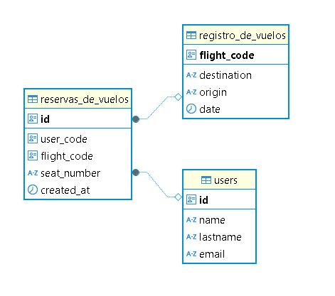 

---

## ⚙️ **Configuración y Ejecución**

### 1️⃣ **Configurar la base de datos (PostgreSQL)**
Ejecuta el siguiente comando en la raíz del proyecto para levantar PostgreSQL en un contenedor Docker:
```bash
docker run --name flights -e POSTGRES_PASSWORD=test -e POSTGRES_DB=flights -e POSTGRES_USER=test -p 5432:5432 timescale/timescaledb:latest-pg14
```

### 2️⃣ **Configurar cada microservicio**
Cada microservicio debe configurarse de manera independiente. 

🔹 **Entrar a la carpeta del microservicio**
```bash
cd buscar.vuelos  # O reservas.vuelos / gestion.usuarios
```

🔹 **Crear y activar un entorno virtual**
```bash
# Windows
python -m venv venv
venv\Scripts\activate

# Mac/Linux
python3 -m venv venv
source venv/bin/activate
```

🔹 **Instalar dependencias**
```bash
pip install -r requirements.txt
```

### 3️⃣ **Ejecutar migraciones (Solo en `buscar_vuelos`)**
Las migraciones deben ejecutarse dentro de la carpeta `buscar_vuelos`, ya que es el servicio encargado de manejar la base de datos principal.
```bash
cd buscar.vuelos
alembic upgrade head
cd ..
```

### 4️⃣ **Iniciar los microservicios** 🚀
Cada microservicio debe iniciarse dentro de su propio entorno virtual.

🔹 **Para `buscar_vuelos` (Puerto 8086)**
```bash
cd buscar.vuelos
venv\Scripts\activate  # (Windows)  
source venv/bin/activate  # (Mac/Linux)
uvicorn main:app --reload --port 8086
```

🔹 **Para `reservar_vuelos` (Puerto 8087)**
```bash
cd reservas.vuelos
venv\Scripts\activate  # (Windows)  
source venv/bin/activate  # (Mac/Linux)
uvicorn main:app --reload --port 8087
```

🔹 **Para `gestion_usuarios` (Puerto 8085)**
```bash
cd gestion.usuarios
venv\Scripts\activate  # (Windows)  
source venv/bin/activate  # (Mac/Linux)
uvicorn main:app --reload --port 8085
```
---

## 📜 **Swagger - Documentación de la API**
Cada microservicio genera su propia documentación en Swagger automáticamente.
- 📌 **Buscar vuelos:** [http://127.0.0.1:8086/docs](http://127.0.0.1:8086/docs)
- 📌 **Reservar vuelos:** [http://127.0.0.1:8087/docs](http://127.0.0.1:8085/docs)
- 📌 **Gestión de usuarios:** [http://127.0.0.1:8085/docs](http://127.0.0.1:8087/docs)

📸 **Ejemplo de consultas en Swagger:**

🔍 **Buscar Vuelos**

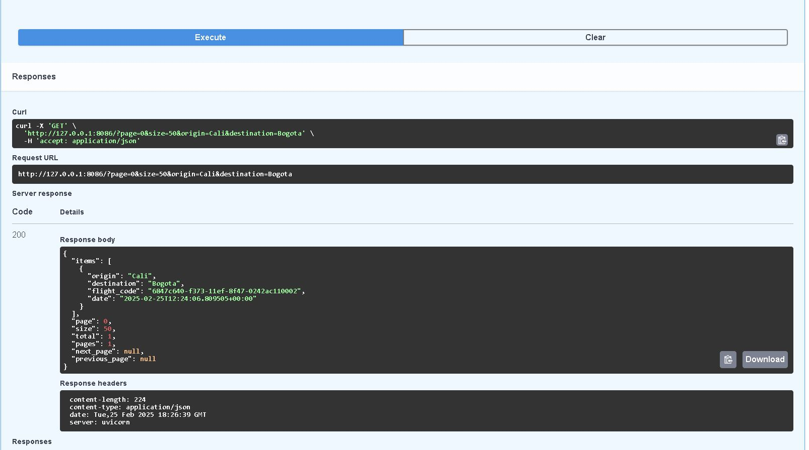
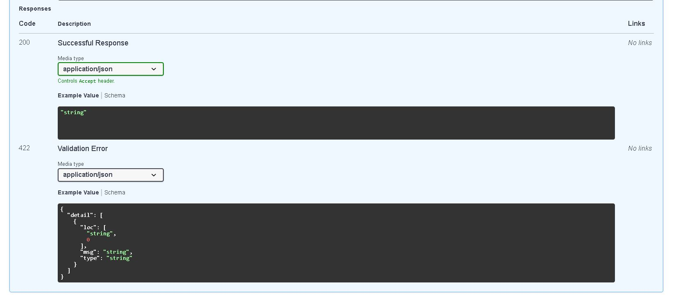

📝 **Reservar Vuelos**
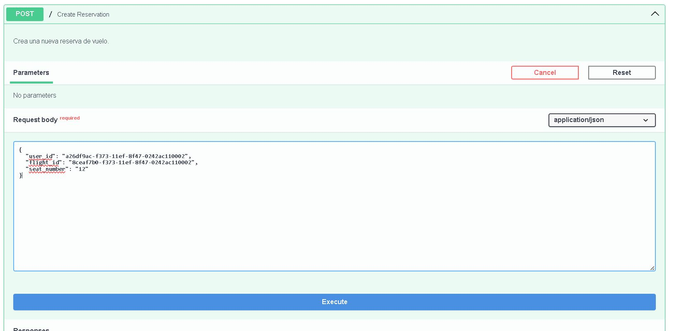
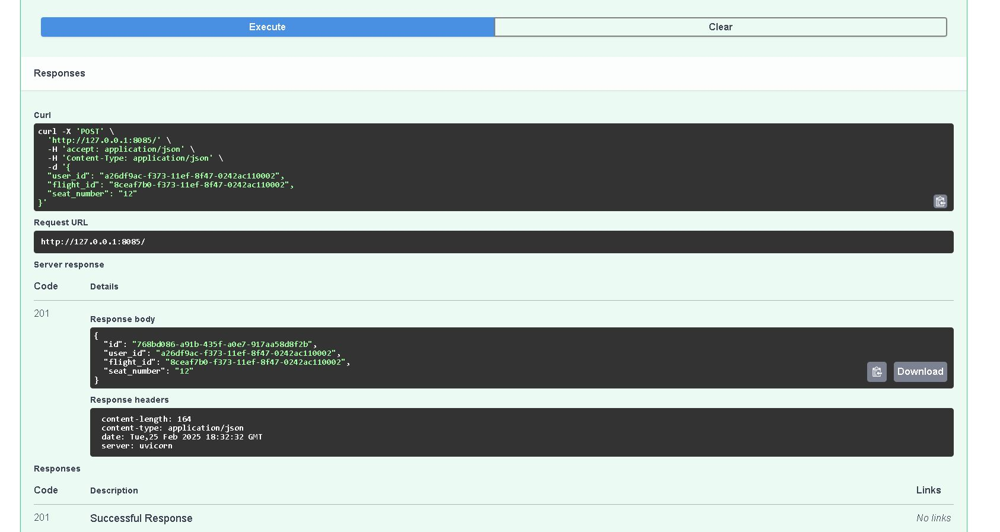
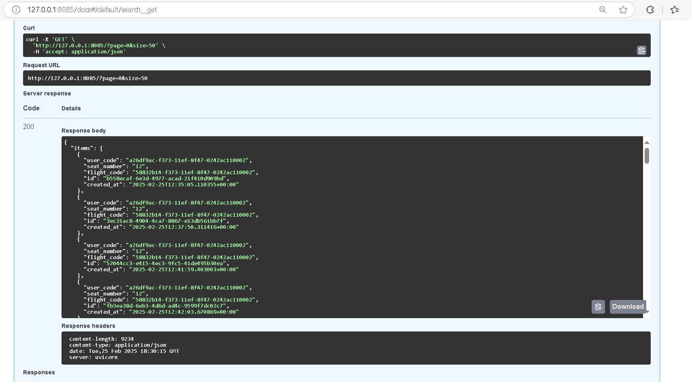
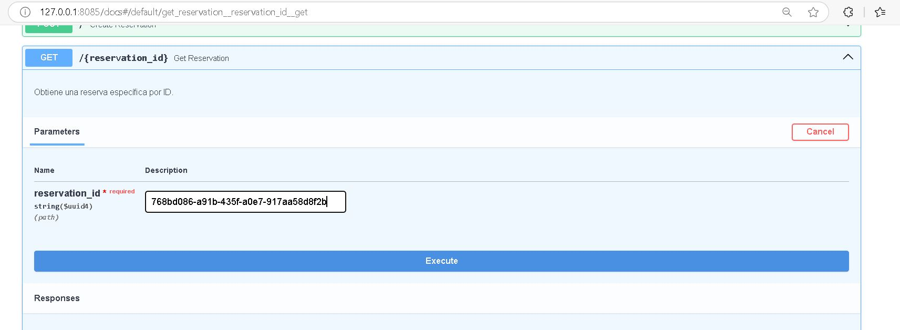
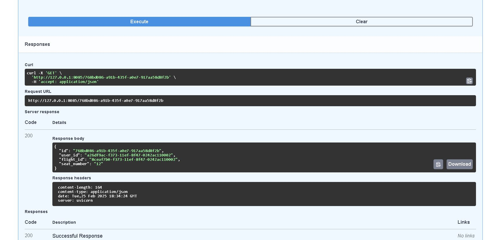
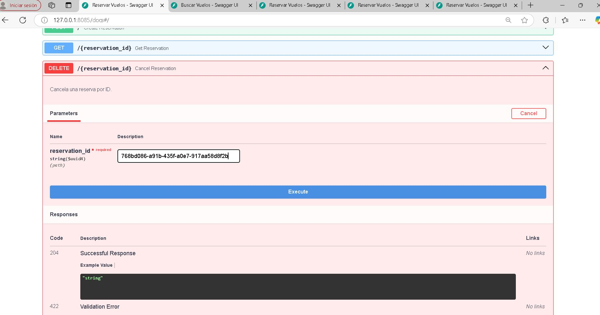
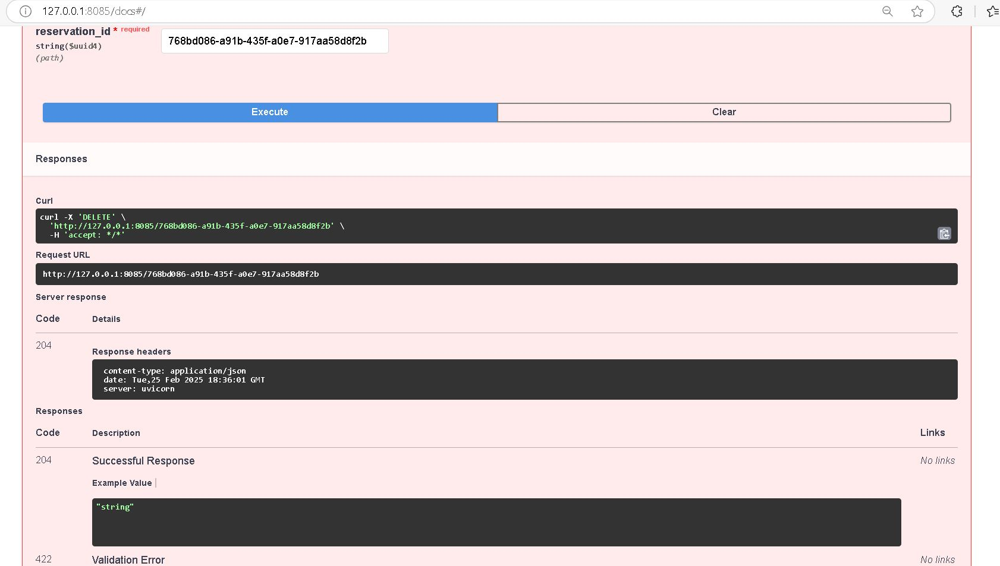

👤 **Gestión de Usuarios**
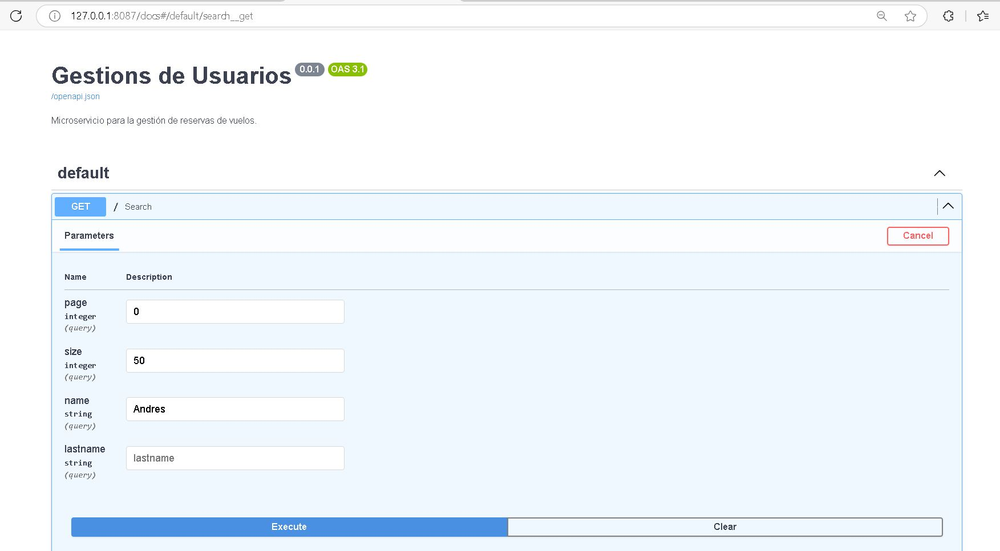
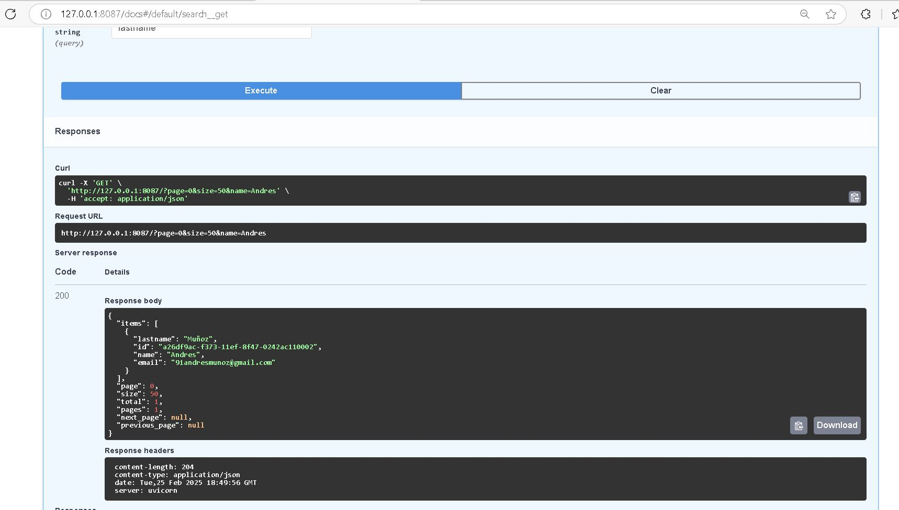
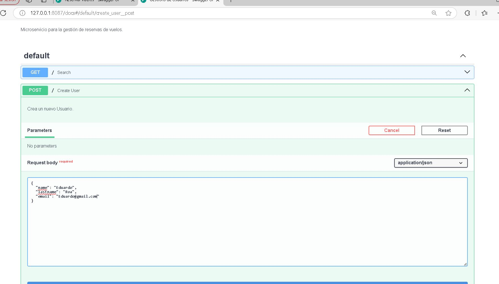
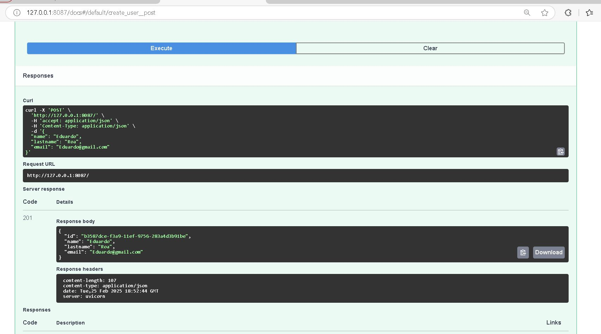

---

## 🧪 **Pruebas Automatizadas con pytest **``

Para ejecutar todas las pruebas en el microservicio `reservas.vuelos`, en el archivo `tests/test_reservations.py`. Se utiliza `pytest` junto con `TestClient` de FastAPI para simular peticiones HTTP. primero activa el entorno virtual y luego corre los comandos:

```bash
# Activar entorno virtual en Windows
venv\Scripts\activate

# Activar entorno virtual en Mac/Linux
source venv/bin/activate
```

Luego, entra al directorio `reservas.vuelos` y ejecuta:

```bash
cd reservas.vuelos
pytest -v
```

📸 **Resultados de las pruebas en Swagger:** A continuación, se muestran capturas de pantalla de las pruebas realizadas en Swagger para verificar el correcto funcionamiento del sistema.

### 🔹 **1️⃣ Creación de Reserva**
📌 Esta prueba verifica que se pueda crear una nueva reserva enviando los datos del usuario, vuelo y asiento.


### 🔹 **2️⃣ Obtención de Reserva por ID**
📌 Se prueba la obtención de una reserva específica por su identificador único.


### 🔹 **3️⃣ Listado de Reservas**
📌 Esta prueba lista todas las reservas almacenadas en la base de datos, asegurando que la paginación y estructura de respuesta sean correctas.


### 🔹 **4️⃣ Cancelación de Reserva**
📌 Se verifica que una reserva pueda marcarse como cancelada sin ser eliminada del sistema.


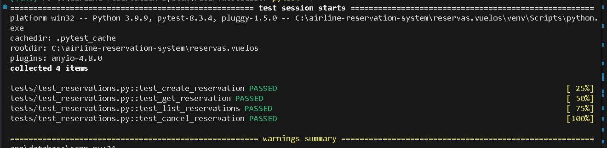


